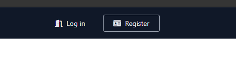
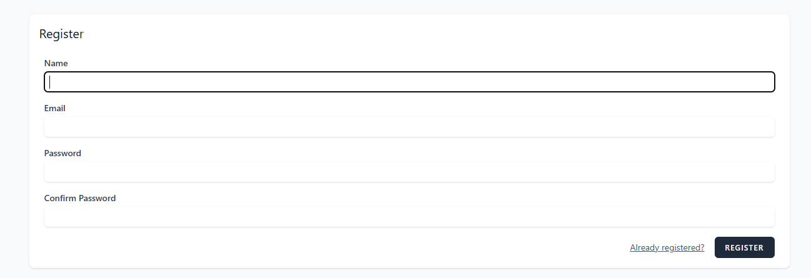
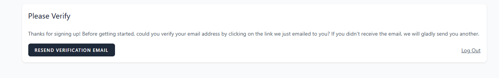
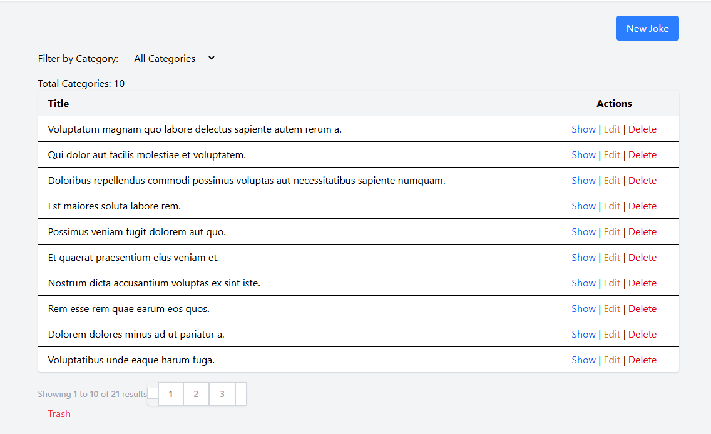
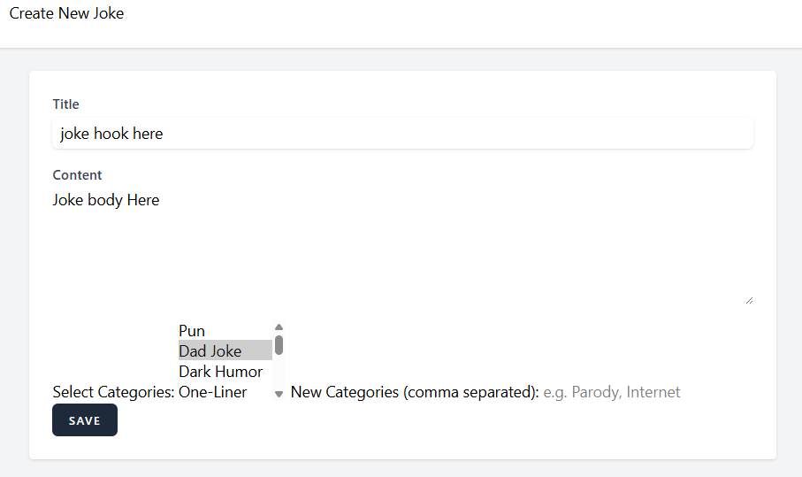
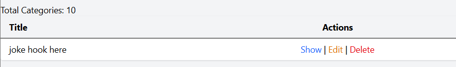
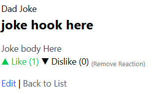

# APPLICATION NAME
<a name="readme-top"></a>

A WebApp for Users to post Jokes and Share them with other Users in a social media(-like) format

#### Built With

[![PHP][Php.com]][Php-url]
[![Laravel][Laravel.com]][Laravel-url]
[![Tailwindcss][Tailwindcss.com]][Tailwindcss-url]
[![Livewire][Livewire.com]][Livewire-url]
[![Inertia][Inertia.com]][Inertia-url]
[![PhpStorm][phpstorm.com]][phpstorm-url]
[![Laragon][Laragon.org]][Laragon-url]

## Definitions

| Term | Definition                                                                                                  |
|----|-------------------------------------------------------------------------------------------------------------|
| BREAD | Database operations to Browse, Read, Edit, Add and Delete data                                               |
| CRUD | More commonly used term over BREAD. Create (Add), Retrieve (Browse/Read), Update (Edit) and Delete (Delete) |

<p align="right">(<a href="#readme-top">back to top</a>)</p>

## Description

This project was made to Share Jokes with other Users in a social media(-like) format.  
My main motivation was to be able to share funny and not-so-funny jokes with friends.  
So I built this project for that reason. to share these short jokes.  
This project solved my issue of knowing what jokes other people found funny.  
specifically I solved this issue with a Like and Dislike System.  
ultimately my takeaway from this project was that I don't want to write another line of PHP again

<p align="right">(<a href="#readme-top">back to top</a>)</p>


## Table of Contents

- [Description](#description)
- [Definitions](#definitions)
- [Installation](#installation)
- [Usage](#usage)
- [Credits](#credits)
- [Licence](#licence)
- [Badges](#badges)
- [Features](#features)
- [Tests](#tests)
- [Contact](#contact)

## Installation

simply Clone the Repo, install npm and composer

```shell
  npm install
  composer install
```

Then run

```shell
    composer run dev
```


<p align="right">(<a href="#readme-top">back to top</a>)</p>


## Usage

TO DO: Provide instructions and examples for use. Include screenshots as 
needed.

To add a screenshot, create an `assets/images` folder in your repository and
upload your screenshot to it. Then, using the relative filepath, add it to
your README using the following syntax:

To Use this Project (as a user) first register using the register button in the navigation bar  
  
Then enter yoour Name, Email and password that you'd like to use for this all and click register  
  
Then verify your account via email.  
  
Congrats, you're a user now. Let's publish your first joke  
There are already some Jokes there but head to the top right and click 'New Joke'  

Now enter the details on the joke. e.g. the hook, the punchline, and the category  
Then hit 'Save'

Finally, you'll be redirected back to the Main Jokes page where you can see your joke.  
From here just hit 'Show' (you can also hit 'Edit' to bring up the editing menu, 
and you can also hit 'Delete' to move the joke to the trash pile)  

Lastly after making your joke. you and others can either 'Like' it or 'Dislike' it.  
If you made an error, or just want to change the joke you can go to the bottom and hit exit.  


<p align="right">(<a href="#readme-top">back to top</a>)</p>


## Credits

- Font Awesome. (n.d.). Fontawesome.com. https://fontawesome.com
- Laravel - The PHP Framework For Web Artisans. (2011). Laravel.com. https://laravel.com
- PHP: Hypertext Preprocessor. (n.d.). Www.php.net. https://php.net
- Professional README Guide. (n.d.). Coding-Boot-Camp.github.io. Retrieved April 15, 2024, from https://coding-boot-camp.github.io/full-stack/github/professional-readme-guide
- TailwindCSS. (2023). Tailwind CSS - Rapidly build modern websites 
  without ever leaving your HTML. Tailwindcss.com. https://tailwindcss.com/


<p align="right">(<a href="#readme-top">back to top</a>)</p>


## Badges

<!-- PROJECT SHIELDS -->
<!--
*** I'm using markdown "reference style" links for readability.
*** Reference links are enclosed in brackets [ ] instead of parentheses ( ).
*** See the bottom of this document for the declaration of the reference variables
*** for contributors-url, forks-url, etc. This is an optional, concise syntax you may use.
*** https://www.markdownguide.org/basic-syntax/#reference-style-links
***
*** Forks, Issues and Licence Shields will NOT appear for Private Repos.
*** You may want to remove this section for this assessment.
*** Delete this block of comments once you have edited this ReadMe.
***
***
-->

[![Forks][forks-shield]][forks-url]
[![Issues][issues-shield]][issues-url]
[![Educational Community Licence][licence-shield]][licence-url]


<p align="right">(<a href="#readme-top">back to top</a>)</p>

## Features

APPLICATION NAME features include but are not limited to:

#### Jokes 

The Jokes Feature has the usual CRUD/BREAD operations including:

* Browse Jokes [Guest, User, Admin]
* Retrieve Joke [Guest, User, Admin]
    * includes search 
* Edit Joke [Admin, Owner]
* Update Joke [Admin, Owner]
* Delete Joke [Admin, Owner]

#### Users

The Users feature includes the standard CRUD/BREAD:

* User self-registration [Guest]
* Login [Registered User]
* Logout [Registered User]
* Profile Edit [Admin, Owner]
* Account Administration [Admin, Owner]

#### Administration

* Work BREAD [Admin]
* User BREAD [Admin]
* Permissions Administration [Admin]

<p align="right">(<a href="#readme-top">back to top</a>)</p>

<!--## Tests

Go the extra mile and write tests for your application. Then provide examples on how to run them here.

<p align="right">(<a href="#readme-top">back to top</a>)</p> -->


## Contact

Ryan Kelley - 20136584@tafe.wa.edu.au

Project Link: https://github.com/sparrowsaurora/RK-saas-fed-at2-pt2

<p align="right">(<a href="#readme-top">back to top</a>)</p>


## Licence

This Project Uses [GNU GPLv3](License.md).


<p align="right">(<a href="#readme-top">back to top</a>)</p>


---


TO DO: Update the links in the MarkDown Links and Images section of the 
original MarkDown document as needed. The links are not visible in the 
rendered page on GitHub. 

<!-- MARKDOWN LINKS & IMAGES -->
<!-- https://www.markdownguide.org/basic-syntax/#reference-style-links -->

[forks-shield]: http://img.shields.io/github/forks/adygcode/workopia-laravel-v11.svg?style=for-the-badge

[forks-url]: https://github.com/AdyGCode/workopia-laravel-v11/network/members

[issues-shield]: http://img.shields.io/github/issues/adygcode/workopia-laravel-v11.svg?style=for-the-badge

[issues-url]: https://github.com/adygcode/workopia-laravel-v11/issues

[licence-shield]: https://img.shields.io/github/license/adygcode/workopia-laravel-v11.svg?style=for-the-badge

[licence-url]: https://github.com/adygcode/workopia-laravel-v11/blob/main/License.md

[product-screenshot]: images/screenshot.png

[Laravel.com]: https://img.shields.io/badge/Laravel-FF2D20?style=for-the-badge&logo=laravel&logoColor=white

[Laravel-url]: https://laravel.com

[Tailwindcss.com]: https://img.shields.io/badge/Tailwindcss-06B6D4?style=for-the-badge&logo=tailwindcss&logoColor=white

[Tailwindcss-url]: https://tailwindcss.com

[Livewire.com]: https://img.shields.io/badge/Livewire-4E56A6?style=for-the-badge&logo=livewire&logoColor=white

[Livewire-url]: https://livewire.laravel.com

[Inertia.com]: https://img.shields.io/badge/Inertia-9553E9?style=for-the-badge&logo=inertia&logoColor=white

[Inertia-url]: https://inertiajs.com

[Php.com]: https://img.shields.io/badge/Php-777BB4?style=for-the-badge&logo=php&logoColor=white

[Php-url]: https://inertiajs.com

[phpstorm.com]: https://img.shields.io/badge/PhpStorm-000000?style=for-the-badge&logo=phpstorm&logoColor=white

[phpstorm-url]: https://www.jetbrains.com/phpstorm/

[Laragon.org]: https://img.shields.io/badge/Laragon-4CAF50?style=for-the-badge&logoColor=white


[Laragon-url]: https://laragon.org/
